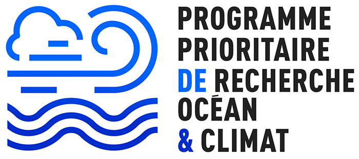

# dc-tools

This repository contains most of the codebase for the Ocean Data Challenges developed as part of the [PPR Océan & Climat](https://www.ocean-climat.fr/).

There are separate repositories for each Data Challenge, which contain their specific configuration.
All those repositories as well as additional code are hosted in the [`ocean-ai-data-challenges` GitHub organization](https://github.com/ocean-ai-data-challenges).

The code for calculating metrics is based on [Mercator Ocean International's `oceanbench` library](https://github.com/mercator-ocean/oceanbench), which we have forked.
We intend on merging back into the original `oceanbench` repository in the near future.
